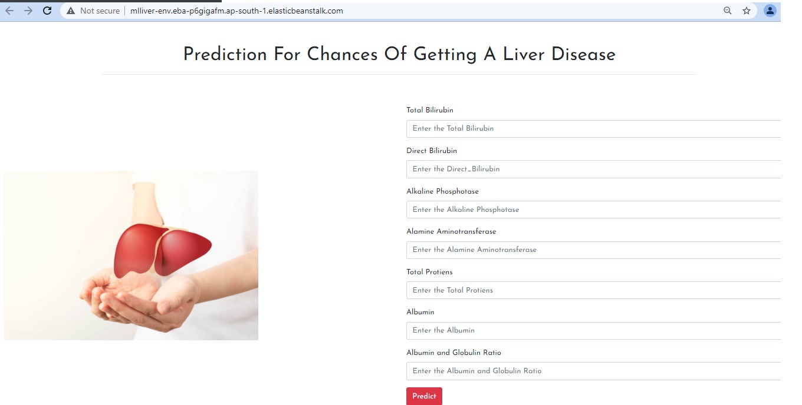

# BUILDING AN INTELLIGENT LIVER DISEASE PREDICTION SYSTEM 

It can perform prediction of liver disease based on required features mention on web application.

  
## Installation Screenshots

- All Directories

- Created Model Result

- Web App Working on AWS Elastic Beanstalk

  
## Deployment

Deployed this project to AWS Elastic Beanstalk

  
## Tech Stack

**Prpgramming Language:** Python

**Libraries:** tensorflow,numpy,scikit-learn,pandas

**API:** Flask

**Frontend Frameworks:** HTML,CSS

**Web Server:** AWS

**IDE:** Pycharm 

  
  
